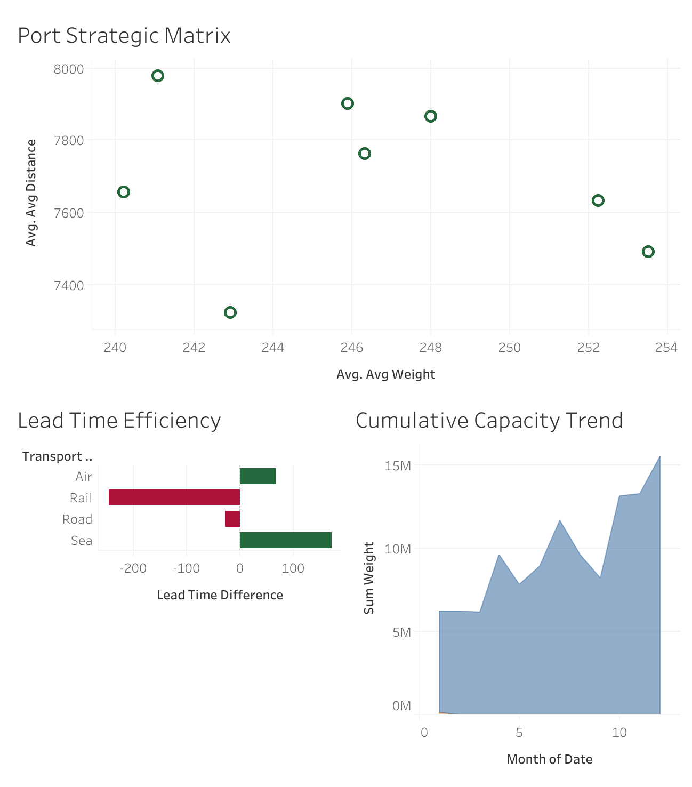

# Logistics Performance & Risk Analysis Dashboard 🚛📊

## 📌 Project Overview
This project showcases a complete end-to-end data analytics pipeline. I engineered complex supply chain metrics in **PostgreSQL** using **Advanced Window Functions** and transformed them into a strategic intelligence dashboard in **Tableau**. The analysis covers 5,000+ logistics transactions to optimize efficiency and mitigate geopolitical risks.

## 🛠️ Tech Stack
- **Database:** PostgreSQL (Mastering Window Functions: `OVER`, `PARTITION BY`, `DENSE_RANK`)
- **BI Tool:** Tableau Public
- **Techniques:** Data Modeling, KPI Development, Risk Scoring

## 🧠 Key Analytical Insights
I addressed five critical business questions using advanced SQL logic:
1. **Port Strategic Matrix:** Correlating average cargo weight vs. shipping distance to identify key logistics hubs.
2. **Geopolitical Risk Ranking:** Dynamically prioritizing ports by risk levels using `DENSE_RANK`.
3. **Capacity Analytics:** Tracking the cumulative growth of shipment tonnage over time (`Running Total`).
4. **Lead Time Variance:** Identifying bottlenecks by comparing actual delivery times against transport mode averages.
5. **Cost Variance:** Monitoring fuel price deviations across product categories to manage procurement budgets.

## 📈 Visual Dashboard

## 📁 Repository Structure
- `supply_chain_analysis.sql`: Contains all analytical SQL logic and View creation.
- `Logistics-Performance-Analysis.png`: High-resolution preview of the Tableau intelligence panel.
- `Logistics-Performance-Analysis.twb`: Tableau workbook file for local exploration.
- `README.md`: Project documentation and business insights.
